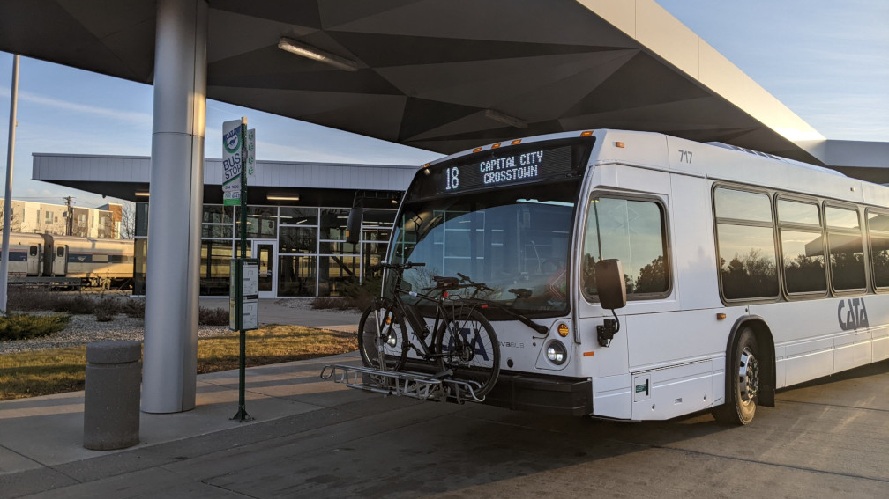
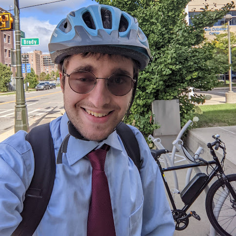

# The Café Car: Mode Shift in the Mitten

Welcome aboard, travelers. Look over the menu and settle in. If you want to be notified when I publish a new article, [subscribe to the blog's RSS feed.](/feed.xml)

*If you aren't familiar with RSS, [here's how it works.](https://aboutfeeds.com)*

## Michigan Services: Menu

### [Calendar of Events](/topics/calendar)

Your one-stop shop for upcoming transportation-related events in Metro Detroit.

### [Adventures](/topics/adventures)
Travel posts and trip reports. Served with a pretzel.

### [Advocacy Efforts](/topics/advocacy)

Promoting better transit across Michigan. Served with chips and a sandwich.

### [Just for Fun](/topics/fun)

Stuff that doesn’t fit anywhere else. Served with a complimentary cheese and cracker tray.

### [#MILegTransit: Legislative Updates](/topics/legislative-updates)

Everything transit in the Michigan Legislature.

### [Public Meeting Coverage](/topics/meetings)

Coverage of local government meetings and advocacy groups, including carbon copies of my past live meeting threads from Twitter and Mastodon. These are dated in accordance with the meeting they cover.

Some entries in this category are links to paid coverage I submitted while on assignment for [Detroit Documenters](https://detroit.documenters.org/). Outlier Media retains editorial control of and publication rights for these submissions; as such, they are not reproduced here.

## About the Blog

 

Hey, hi, hello, Corey here! Welcome to the new home for my legislative tracking efforts, advocacy updates, and transit adventures in Michigan. [You can also find me on social media.](/social)